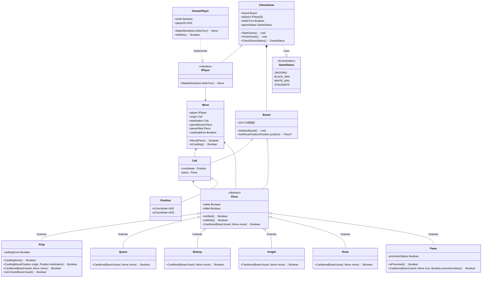

```mermaid
classDiagram
    %% Pieces Extension
    Piece <|-- King : Extends
    Piece <|-- Queen : Extends
    Piece <|-- Bishop : Extends
    Piece <|-- Knight : Extends
    Piece <|-- Rook : Extends
    Piece <|-- Pawn : Extends

    %% Implementation of IPlayer. May be further expanded
    HumanPlayer ..|> IPlayer : Implements

    %% Baseline default object
    Cell <-- Piece
    Cell o-- Position
    Board o-- Cell


    %% Movement Engine
    Move <-- Cell
    Move <-- Piece
    Board o-- Piece
    IPlayer --> Move

    %% Game Env Generation
    ChessGame o-- IPlayer
    ChessGame *-- Board
    ChessGame ..|> GameStatus : Uses
    
    class ChessGame{
        +board  Board
        +players  IPlayer[2]
        +whiteTurn  Boolean
        +gameStatus GameStatus
        +StartGame() : void
        +FinishGame() : void
        +CheckGameStatus() : GameStatus

    }

    class Board{
        
        +size Cell[8][8]
        +InitializeBoard() : void
        +GetPiecePosition(Position position) : Piece?

    }
    class Cell{
        
        +coordinate : Position
        +piece : Piece
    }
    class IPlayer{
        <<Interface>>
        +MakeMove(bool whiteTurn) : Move
    }
    class HumanPlayer{
        
        +white Boolean
        +playerID int32
        +MakeMove(bool whiteTurn) : Move
        +IsWhite() : Boolean
    }
    class Move{
        
        +player IPlayer
        +origin  Cell
        +destination  Cell
        +pieceMoved  Piece
        +pieceKilled  Piece
        +castlingMove  Boolean
        +Move(Piece) : Boolean
        +IsCastling(): Boolean
    }
    class Position{
        
        +xCoordinate  int32
        +yCoordinate  int32
    }
    class GameStatus{
        <<Enumeration>>
        ONGOING
        BLACK_WIN
        WHITE_WIN
        STALEMATE
    }
    class Piece{
        <<Abstract>>
        +white  Boolean
        +killed  Boolean
        +isKilled() : Boolean
        +IsWhite() : Boolean
        +CanMove(Board board, Move move) : Boolean

    }
    class King{
        
        -castlingDone Boolean
        +CastlingDone() : Boolean
        +CastlingMove(Position origin, Position destination) : Boolean
        +CanMove(Board board, Move move) : Boolean
        +IsInCheck(Board board) : Boolean
    }
    class Queen{
        
        +CanMove(Board board, Move move) : Boolean
    }
    class Knight{
        
        +CanMove(Board board, Move move) : Boolean

    }
    class Bishop{
        
        +CanMove(Board board, Move move) : Boolean
        
    }
    class Rook{
        
        +CanMove(Board board, Move move) : Boolean

    }
    class Pawn{
        
        -promotionStatus Boolean
        +isPromoted() : Boolean
        +CanMove(Board board, Move mov, Boolean promotionStatus) : Boolean
    }
```