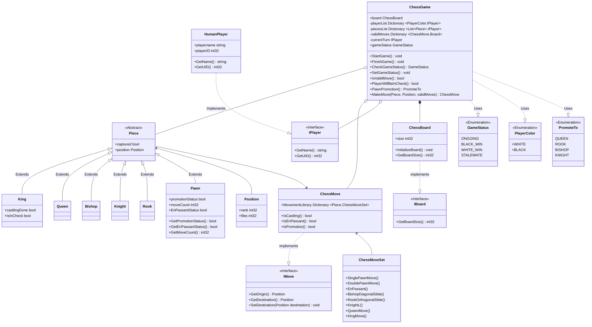

```mermaid
classDiagram
%%  Extension
Piece <|-- King : Extends
Piece <|-- Queen : Extends
Piece <|-- Bishop : Extends
Piece <|-- Knight : Extends
Piece <|-- Rook : Extends
Piece <|-- Pawn : Extends

%% Implementation of IPlayer. May be further expanded
HumanPlayer ..|> IPlayer : Implements

%% Baseline default object
ChessBoard ..|> IBoard : implements
Piece <-- Position
ChessGame o-- Piece

%% Movement Engine
ChessMove ..|> IMove : implements
ChessMove <-- ChessMoveSet
ChessGame o-- ChessMove
Piece --> ChessMove

%% Game Env Generation
ChessGame o-- IPlayer
ChessGame *-- ChessBoard
ChessGame ..|> GameStatus : Uses
ChessGame ..|> PlayerColor : Uses
ChessGame ..|> PromoteTo : Uses

class ChessGame{
    +board  ChessBoard
    -playerList Dictionary ~PlayerColor.IPlayer~
    -piecesList Dictionary ~List~Piece~.IPlayer~
    -validMoves Dictionary ~ChessMove.Board~
    -currentTurn IPlayer
    +gameStatus GameStatus
    +StartGame() void
    +FinishGame() void
    +CheckGameStatus() GameStatus
    +SetGameStatus() void
    +IsValidMove() bool
    +PlayerWillBeInCheck() bool
    +PawnPromotion() PromoteTo
    +MakeMove(Piece, Position, validMoves) ChessMove

}
class PlayerColor{
    <<Enumeration>>
    +WHITE
    +BLACK
}
class ChessBoard{
    
    +size int32
    +InitializeBoard() void
    +GetBoardSize() int32

}
class IBoard{
    <<Interface>>
    +GetBoardSize() int32
}
class IPlayer{
    <<Interface>>
    +GetName() string
    +GetUID() int32
}
class HumanPlayer{
    
    +playername string
    +playerID int32
    +GetName() string
    +GetUID() int32
}
class ChessMove{
    
    +MovementLibrary Dictionary ~Piece.ChessMoveSet~
    +IsCastling() bool
    +IsEnPassant() bool
    +IsPromotion() bool

}
class IMove{
    <<Interface>>
    +GetOrigin() Position
    +GetDestination() Position
    +SetDestination(Position destintation) void
}
class ChessMoveSet{
    +SinglePawnMove()
    +DoublePawnMove()
    +EnPassant()
    +BishopDiagonalSlide()
    +RookOrthogonalSlide()
    +KnightL()
    +QueenMove()
    +KingMove()
}
class Position{
    
    +rank  int32
    +files  int32
}
class GameStatus{
    <<Enumeration>>
    ONGOING
    BLACK_WIN
    WHITE_WIN
    STALEMATE
}
class PromoteTo{
    <<Enumeration>>
    QUEEN
    ROOK
    BISHOP
    KNIGHT
}
class Piece{
    <<Abstract>>
    +captured  bool
    +position Position
}
class King{
    
    +castlingDone bool
    +IsInCheck bool
}
class Queen{
    
}
class Knight{
    

}
class Bishop{
    
    
}
class Rook{
    

}
class Pawn{
    
    +promotionStatus bool
    +moveCount int32
    +EnPassantStatus bool
    +GetPromotionStatus() bool
    +GetEnPassantStatus() bool
    +GetMoveCount() int32
}
```