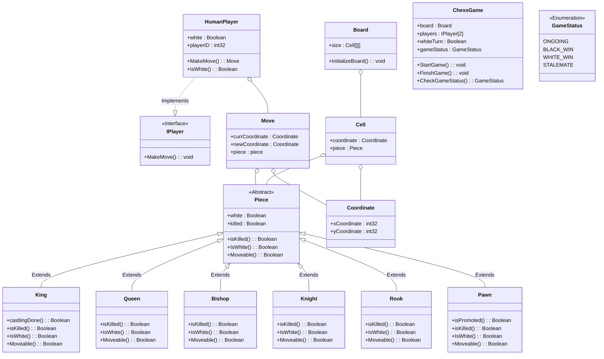

```mermaid
classDiagram
    Piece <|-- King : Extends
    Piece <|-- Queen : Extends
    Piece <|-- Bishop : Extends
    Piece <|-- Knight : Extends
    Piece <|-- Rook : Extends
    Piece <|-- Pawn : Extends

    HumanPlayer ..|> IPlayer : Implements

    Cell o-- Piece
    Cell o-- Coordinate
    Move o-- Coordinate
    Move o-- Piece
    Board o-- Cell

    HumanPlayer o-- Move
    
    class ChessGame{
        +board : Board
        +players : IPlayer[2]
        +whiteTurn : Boolean
        +gameStatus : GameStatus
        +StartGame() : void
        +FinishGame() : void
        +CheckGameStatus() : GameStatus

    }

    class Board{
        
        +size : Cell[][]
        +InitializeBoard() : void

    }
    class Cell{
        
        +coordinate : Coordinate
        +piece : Piece
    }
    class IPlayer{
        <<Interface>>
        +MakeMove() : void
    }
    class HumanPlayer{
        
        +white : Boolean
        +playerID : int32
        +MakeMove() : Move
        +IsWhite() : Boolean
    }
    class Move{
        
        +currCoordinate : Coordinate
        +newCoordinate : Coordinate
        +piece : piece
    }
    class Coordinate{
        
        +xCoordinate : int32
        +yCoordinate : int32
    }
    class GameStatus{
        <<Enumeration>>
        ONGOING
        BLACK_WIN
        WHITE_WIN
        STALEMATE
    }
    class Piece{
        <<Abstract>>
        +white : Boolean
        +killed : Boolean
        +isKilled() : Boolean
        +IsWhite() : Boolean
        +Moveable() : Boolean

    }
    class King{
        
        +castlingDone() : Boolean
        +isKilled() : Boolean
        +IsWhite() : Boolean
        +Moveable() : Boolean
    }
    class Queen{
        
        +isKilled() : Boolean
        +IsWhite() : Boolean
        +Moveable() : Boolean

    }
    class Knight{
        
        +isKilled() : Boolean
        +IsWhite() : Boolean
        +Moveable() : Boolean

    }
    class Bishop{
        
        +isKilled() : Boolean
        +IsWhite() : Boolean
        +Moveable() : Boolean
        
    }
    class Rook{
        
        +isKilled() : Boolean
        +IsWhite() : Boolean
        +Moveable() : Boolean

    }
    class Pawn{
        
        +isPromoted() : Boolean
        +isKilled() : Boolean
        +IsWhite() : Boolean
        +Moveable() : Boolean
    }
```